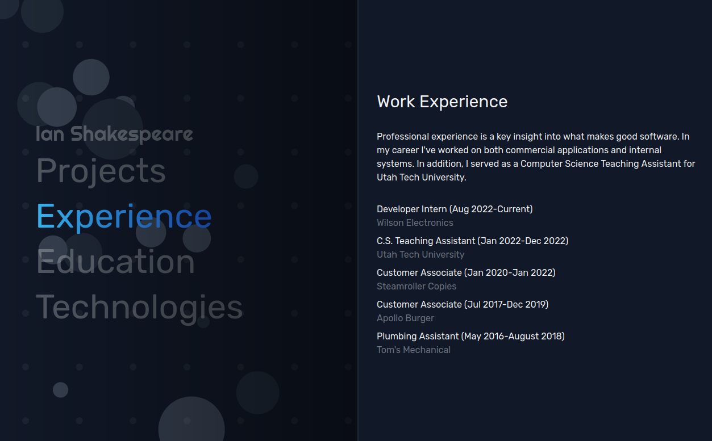

# Shakespeare Dev

The personal directory and resume for Ian Shakespeare. The site can be found [here](https://shakespeare.dev). On shakespeare.dev you can find projects, experience, education, and technology information for Ian Shakespeare. Any questions, bugs, and business inquiries can be directed to [this email](mailto:ian@shakespeare.dev).

Shakespeare Dev is built with SvelteKit and Tailwind. Particles are a custom drawn canvas component, written in vanilla TypeScript. The site is live and deployed on GitHub Pages.
